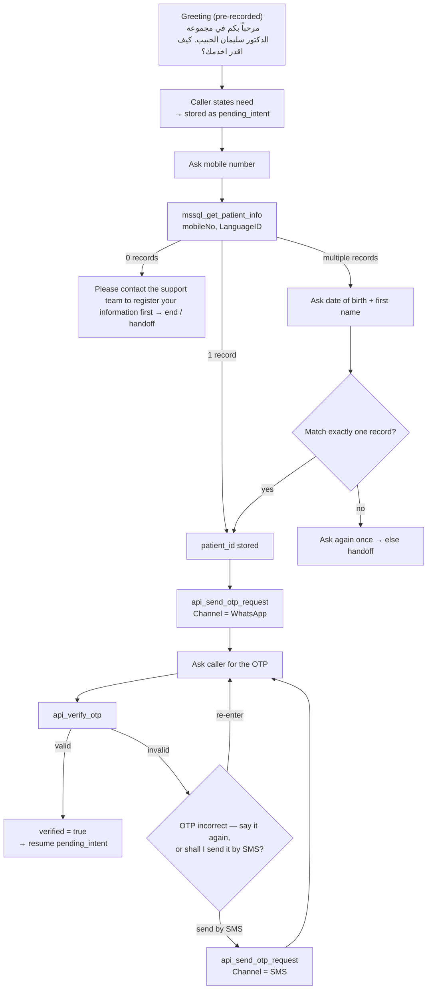

# Flow: Authenticate (runs first on every call)

Source: user specification, 2026-09-27. Implemented by `skills/authenticate/`.

**Hard rule:** no other skill (booking, reports, insurance, …) and no patient-data tool runs until the caller is verified by OTP.
The harness enforces this in the policy layer (`auth_gate`), not only in the prompt.

## Steps

## Step details

| # | Step | Tool | Inputs | Outputs → state |
|---|------|------|--------|-----------------|
| 0 | Greeting | — (pre-recorded audio) | — | caller's first utterance → `pending_intent`, `language_id`, first gender estimate |
| 1 | Mobile number | — | spoken digits (Arabic / English, "صفر خمسة أربعة…") → normalized to local `05XXXXXXXX` (e.g. `054…`); `+9665…` / `9665…` / `5…` converted | `mobile_no` |
| 2 | Lookup | `mssql_get_patient_info` | `mobileNo`, `LanguageID`* | 0 / 1 / N records |
| 3 | Disambiguate (N>1 only) | — | date of birth (**Gregorian only**, → `YYYY-MM-DD`) + first name, matched against the returned records (Arabic + English names, normalized) | `patient_id` |
| 4 | Send OTP | `api_send_otp_request` | `PatientId`*, `Channel`=WhatsApp, `LanguageID`* | — |
| 5 | Verify OTP | `api_verify_otp` | `Otp` (spoken digits → normalized), `PatientId`*, `LanguageID`* | `verified` |
| 5b | Wrong OTP | `api_send_otp_request` (only if caller asks) | `Channel`=SMS | — |

\* injected by the harness from session state.

## Rules
- The caller's first utterance is kept as `pending_intent` so, after verification, the agent continues with what they asked for without asking again.
- No record → *"Please contact the support team to register your information first"* (Arabic: يرجى التواصل مع فريق الدعم لتسجيل بياناتك أولاً), then close politely / hand off.
- Record details (name, DOB, other family records) are never read out before verification.
- Limits (confirmed): 3 OTP attempts, 2 DOB / first-name attempts → human handoff.
- The whole call — prompts, tool `LanguageID`, TTS voice — follows the caller's language (Arabic → 1, English → 2).
