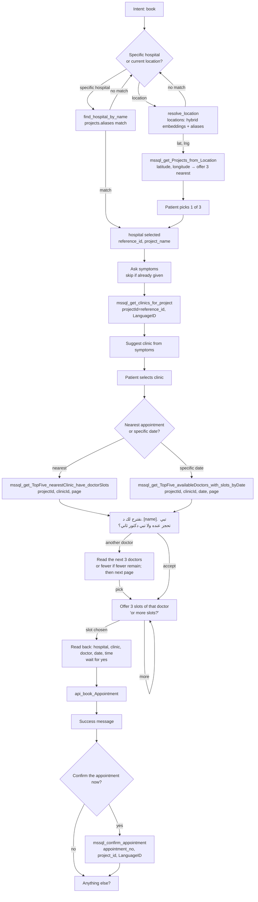

# Flow: Book Appointment

Source: user specification, 2026-09-27 (Q2 / Q5 answers applied). This is the contract that `skills/book_appointment/` (SKILL.md + flow.yaml) implements.

## Preconditions

The caller has been verified by the [authenticate flow](authenticate.md) (mobile → patient record → OTP).
`patient_id` and `language_id` are in session state. "Book an appointment" (from `pending_intent` or a later request) activates this skill.

## Steps

## Step details

| # | Step | Tool | Inputs | Outputs → slots |
|---|------|------|--------|-----------------|
| 1 | Hospital preference | — | — | `hospital_mode` = name \| location |
| 2a | Hospital by name | `find_hospital_by_name` *(local)* | caller's words | `project_id` (= reference_id), `project_name` |
| 2b | Resolve location | `resolve_location` *(local, hybrid search on `locations`)* | caller's words | `lat`, `lng` |
| 2c | Nearby hospitals | `mssql_get_Projects_from_Location` *(MCP)* | `latitude`, `longitude`, `LanguageID`* | top 5 returned, 3 nearest offered → caller picks → `project_id`, `project_name` |
| 3 | Symptoms | — | skip if already stated | `symptoms` |
| 4 | Clinic | `mssql_get_clinics_for_project` | `projectId`, `LanguageID` | agent suggests one → `clinic_id`, `clinic_name` |
| 5 | Date preference | — | — | `date_mode` = nearest \| date; `date` (YYYY-MM-DD) |
| 6a | Doctors, nearest | `mssql_get_TopFive_nearestClinic_have_doctorSlots` | `projectId`, `clinicId`, `page` | doctor list with slots |
| 6b | Doctors, on date | `mssql_get_TopFive_availableDoctors_with_slots_byDate` | `projectId`, `clinicId`, `date`, `page` | doctor list with slots |
| 7 | Doctor | — | propose the first doctor; "another doctor" → read the next 3 (or fewer if fewer remain), then fetch next `page` | `doctor_id`, `doctor_name` |
| 8 | Slot | — | 3 at a time; "more" → next 3 | `slot_date`, `slot_time` |
| 9 | Read-back | — | non-interruptible, needs explicit yes | — |
| 10 | Book | `api_book_Appointment` | ProjectID, ClinicID, DoctorID, PatientID*, StartTime, StrAppointmentDate, LanguageID* | `appointment_no` |
| 11 | Confirm | `mssql_confirm_appointment` | `appointment_no`, `project_id`, LanguageID* | `confirmed` |

\* injected by the harness from session state, hidden from the LLM.

## Cross-cutting rules

- **Language:** the whole call is in the caller's language — Arabic (Najdi, `LanguageID`=1, Arabic voice) or English (`LanguageID`=2, English voice). Detected from STT language + text.
- **Gender-aware speech:** the agent addresses the caller with the correct grammatical gender (تبي / تبين، حاب / حابة).
  The patient record has no gender, so it is resolved from: open-source voice gender classifier on the caller's audio, overridden by the caller's self-reference in speech (e.g. "أنا تعبانة"). Neutral phrasing until confident.
- **No medical advice:** symptoms are used only to pick a clinic. Red-flag symptoms (chest pain, breathing difficulty, stroke signs, severe bleeding) → direct to ER / 997 immediately.
- **Voice brevity:** max 3 options read out at a time; one question per turn.
- **Relative dates:** "بكرة", "الأحد الجاي", "بعد أسبوع" are resolved in Asia/Riyadh time before calling tools.
- **Errors:** no slots → offer another date / another doctor / another hospital; tool failure → apologise, retry once, then offer human handoff.
